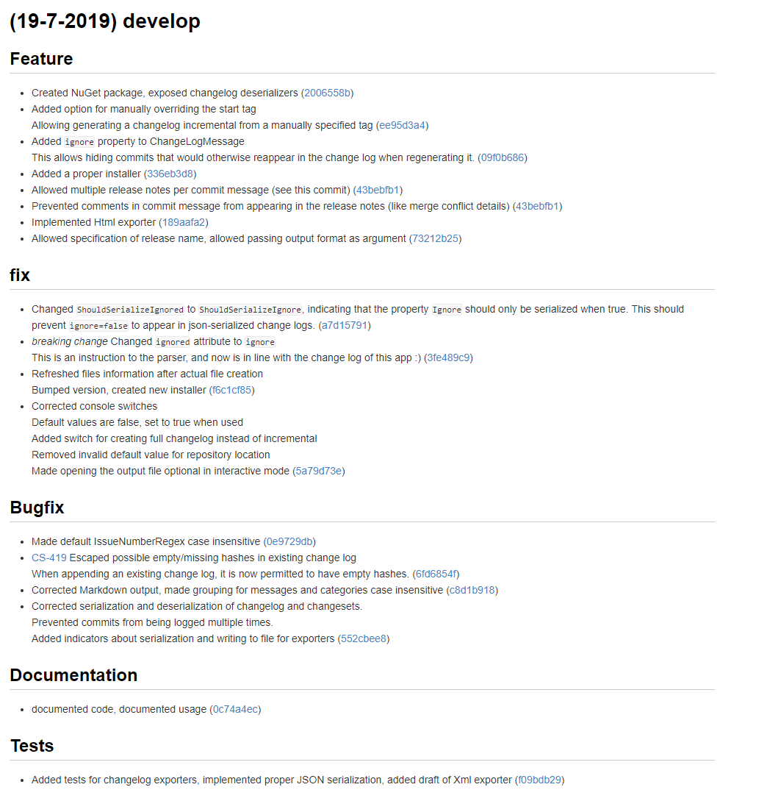

# CS Changelog generator

[TOC]

## TLDR;

Following a few commit-message and branching conventions, this utility creates or appends a change log.

1. Write your change log message in commit messages like:

   > [hotfix] ABC-123 human-friendly message 

2. Name your feature and hotfix branches following [Gitflow](https://nvie.com/posts/a-successful-git-branching-model/) standards, with features/fixes optionally containing issue numbers:

   > feature/abc-123_Buttons_with_expected_long_operation_now_waiting_animation 

3. Create or append to an existing changelog in ` Json`, `XML`, `Markdown` or `Html`.
   *Suggestion: do this when starting a new release branch.*
   NB: `Html`  For now format only supports creation, not appending.

## Usage

Switch to the branch you are creating a changelog for, usually this is a release or hotfix branch.
Run `cs.changelog.console.exe`. 
This will generate a Json-based changelog, creating or appending to an existing changelog, named ` changelog.json`. Changes will contain the change since the last change on the `master` branch.
Feature analysis (to determine if features or hotfixes are added) is based on default Gitflow branching names and commit messages.

### Optional arguments:

```
-n, --releasename         (Default: '')
                          The name of the release (like 'operation high ground' or 'preview')

-g, --pathToGit           (Default: git)
                          Path to git

-r, --repositoryDirectory (Default: '')
                          Path to the repository

    --replace             (Default: False)
                          When set replaces the target file, instead of appending.

-f, --filename            (Default: Changelog)
                          The file to write to, if no file extension is specified, output-specific extension will be added.

-o, --outputformat        (Default: JSON)
                          The output format

-v, --verbosity           (Default: Debug)
                          Prints all messages to standard output

    --full                (Default: False)
                          By default only changes since the last release need to be included, when set includes all changes.

-s, --startTag            (Default: null)
                          In order to make an incremental change log since a specified tag. If no tag is specified auto-detects the last release tag.
                          If a tag is specified, overrides option --full

--issueformat             (Default: IssueNumberRegexDefault)
                          Expression for recognizing issue numbers

--issuetrackerurl         (Default: https://project.cs.nl/issue/{0})
                          Url for recognizing issue numbers. '{0}' will be substituted with issue number

--repositoryurl           Url for showing commit details

--dontlinkifyissuenumbers (Default: False)
                          When set recognized issue numbers will be not converted to links

--branch_development      (Default: develop)
                          The development branch

--branch_master           (Default: master)
                          The master branch

--branch_preview          (Default: preview)
                          The preview branch

--prefix_hotfix           (Default: hotfix)
                          The prefix of hotfix branches

--prefix_release          (Default: release)
                          The prefix of release branches

--prefix_feature          (Default: feature)
                          The prefix of release ranches

--category_feature        (Default: Feature)
                          The display label of the feature category

--category_hotfix         (Default: Hotfix)
                          The display label of the hotfix category

--help                    Display this help screen.

--openfile                   Open file after generation
```

## About changelog generation

Based on the commit history of a repository a changelog can be generated. A few rules apply:

- By default only changes that are not yet on production (`master`) will be listed

- Commit messages with a category prefix will always be included, like

  > `[Feature] Human-friendly of my beautiful feature`
  >
  > `[Hotfix] Description of the thing that was fixed (and tested)` 
  >
  > `[Cosmetics] ABC-42 A shiny new button has been added`

- Merging of feature branches and hotfixes will be recognized automatically (based on their commit messages). The branch name will be added as a commit message (underscores will be replaced).

  Please adhere to the existing guidelines for naming feature/hotfix branches:

  > `feature/issuenumber descriptivename`

- A commit following the above mention convention upon completion of a feature/hotfix will override the feature/hotfix name

- Identical messages within a category can be grouped in the UI 

- References to issue numbers can be linked to in the UI

- References to commits can be linked to in the UI

## When to execute (manually on in a build step)

- After creating a new `release` branch
- After finishing a hotfix (execute on ``master`` branch)
- When merging the ``develop`` branch into the current release branch
- When adding features to the `release` branch (this is not good practice)

## After execution

Manually correct the generated output file (this is the actual work) and commit it. The format is pretty self explanatory.
Expected corrections:

- Commit category correction
- Making the message more human friendly
- Grouping messages into one.
- Adding missing issue number links

You can generate a preview by changing the output type to html.

> Advanced and *to be implemented* when using output format Html
>
> When the output is appending changes (this is the default), *and* the output type is html. There will be (should be) an intermediate, serializable output file in which to make changes and which to commit. (the html output file cannot be deserialized easily and therefore does not support appending without an intermediate file.)

### Ignoring commits

When a commit is detected to be changelog-worthy, but you think otherwise, you can add the attribute ` ignore=true` , instructing any UI generators to ignore the commit. This only effective in `Json` and `XML`, but will be honoured when `Html` output will support intermediate format.

## Example

See actual [changelog.md](changelog.md).

or

`Html` output, based in this repository: 



